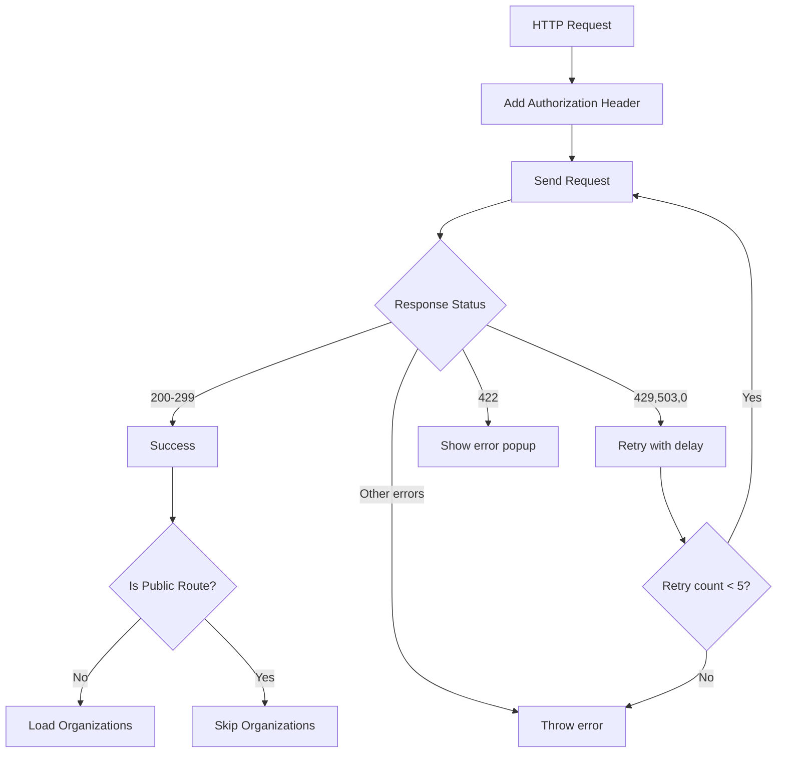

# Headers Interceptor

HTTP интерцептор для добавления заголовков авторизации и обработки ошибок.

## 📋 Функциональность

### 🔐 Авторизация
- Автоматически добавляет `Authorization: Bearer {token}` к запросам
- Обновляет токен при необходимости через `AuthService`

### 🔄 Retry механизм
- Автоматически повторяет запросы при ошибках 429, 503, 0
- Максимум 5 попыток с экспоненциальной задержкой
- Задержки: 2s, 4s, 8s, 16s, 32s

### 🏢 Загрузка организаций
- Автоматически загружает организации после успешных запросов
- **Исключение 1:** Не загружает для публичных API роутов
- **Исключение 2:** Не загружает если пользователь находится на публичной странице

### 📊 Статус запросов
- Эмитит статус начала и завершения запросов через `ReqStatusService`
- Показывает overlay при статусе 429 (Too Many Requests)

### ❌ Обработка ошибок
- Показывает информационные попапы для ошибок 422
- Логирует ошибки с детальной информацией

## 🛣️ Публичные роуты

### API роуты
Для следующих API роутов **НЕ** выполняется загрузка организаций:

```typescript
const PUBLIC_API_ROUTES = [
    '/api/auth',              // авторизация
    '/api/public',            // публичные API
    '/api/registration',      // регистрация
    '/api/phone_auth_challenges', // SMS коды
    '/api/organizations',     // создание организаций
    '/api/employees'          // создание сотрудников
];
```

### Фронтенд страницы
Если пользователь находится на следующих страницах, загрузка организаций **НЕ** выполняется:

```typescript
const PUBLIC_FRONTEND_ROUTES = [
    '/auth',                  // страница авторизации
    '/registration'           // страница регистрации
];
```

### 📝 Связь с фронтенд роутами

Эти API роуты соответствуют публичным страницам из `src/routes/public`:
- `/auth` → использует `/api/auth`, `/api/phone_auth_challenges`
- `/registration` → использует `/api/registration`, `/api/organizations`, `/api/employees`

## 🎯 Использование

Интерцептор подключается автоматически в `app.config.ts`:

```typescript
providers: [
  provideHttpClient(
    withInterceptors([headersInterceptor])
  )
]
```

## 🔧 Зависимости

- `AuthService` - управление токенами
- `OrganizationStore` - загрузка организаций  
- `ReqStatusService` - статусы запросов
- `DefaultOverlayService` - overlay для UI
- `InformationPopupService` - показ ошибок
- `Router` - проверка текущей страницы

## 📊 Логика работы



## ⚡ Производительность

- **Двойная оптимизация:** Пропуск загрузки организаций как для публичных API роутов, так и для публичных страниц
- **Кэширование:** Проверка существующей выбранной организации
- **Batching:** Один таймер для множественных overlay
- **Memory:** Правильная очистка подписок